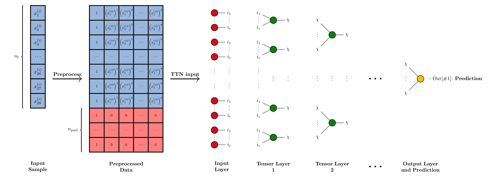

# Tree Tensor Network Supervised Classifier for HEP

In this repository we present the code needed to implement a classifier for High Energy Physics events using a Tree tensor Network architecture.


<center>
    
</center>


## Authors

* [**Rocco Ardino**](https://github.com/RoccoA97) (University of Padua)
* [**Alessandro Valente**](https://github.com/mastrovalentz) (University of Padua)


## Abstract
In this work we discuss the implementation of a supervised Tree Tensor Network classifier using TensorFlow and TensorNetwork frameworks. To validate the method, we apply it to a classical signal-versus-background classification task on the HIGGS dataset, a standard in Machine Learning researches inside HEP field. So, we treat in detail the necessary preliminary operations, such as data preprocessing and Tree Tensor Network hyperparameters optimisation, needed to boost significantly the classifier performances. The results obtained are then presented, focusing also on the time performances of the algorithm. We conclude with a comparison of our approach with the results obtained by [[1]](https://arxiv.org/pdf/1402.4735.pdf), in which a classical Deep Neural Network is used, and discussing also the possible improvements of our method.


## Dataset
The dataset employed is the so-called Baldi `HIGGS` dataset. It is not included here due to its dimensions but it can be downloaded [here](https://archive.ics.uci.edu/ml/datasets/HIGGS).

In order to run the code, the dataset should be downloaded from the previous link and positioned in the `data/` folder (which has to be created inside the main folder of this repository).


## Structure of the repository

The repository is organized as follows:
- **`src`**: this folder contains the code needed to implement a TTN classifier alongside with an example of its implementation and some script that can be used to tune the model and/or train a model with specific parameter;
- **`plots`**: this folder contains the code needed to realize all the plots shown in the final report of the project;
- **`report`**: this folder contains a PDF report showing the results of the project;
- **`model`**: this folder contain some trained architectures including the one presented as the best model in the project report;
- **`json`**: this folder contains the history of some of the trained model and the results of the tuning procedure we conducted;
- **`references`**: this folder contains some of the literature we used as reference.

For more detailed information, it is possible to refer to the dedicated README file of each folder.


## Requirements

The packages required to correctly execute the code in this repository are contained in the **`requirements.txt`** file.

Instead of directly installing all the required packages we suggest the creation of a dedicated environment using the Anaconda (or pip) package manager, if you already have it installed you can create the environment by running

```
conda install --name tn-env --file requirements.txt
```
